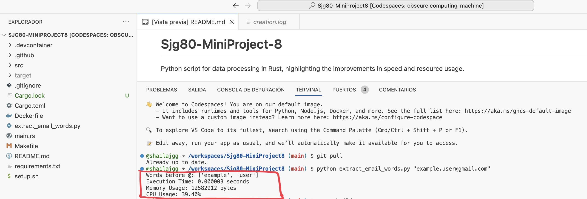
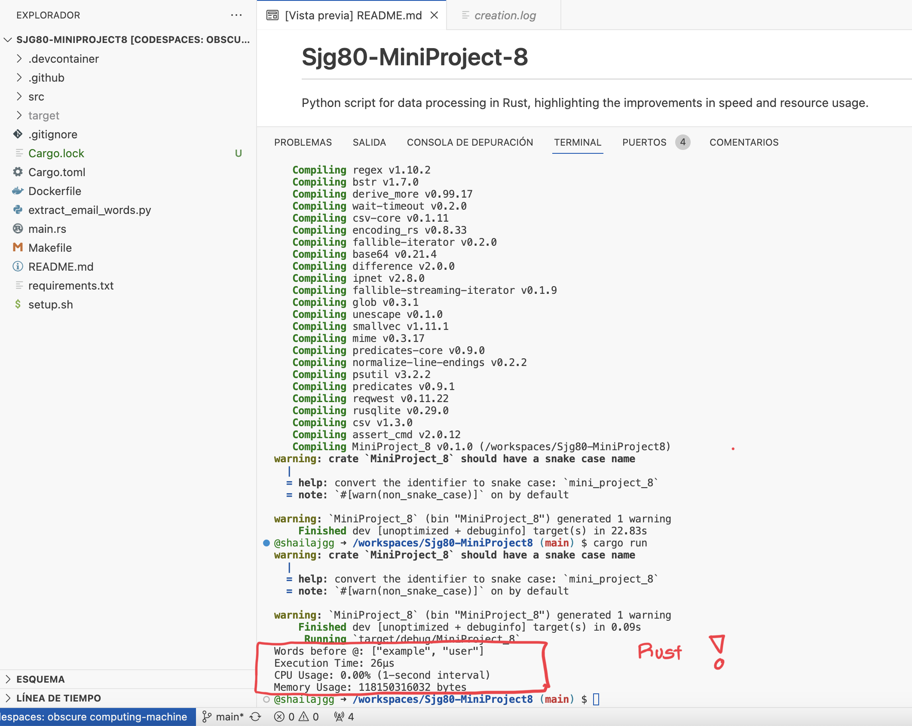

# Sjg80-MiniProject-8
Python script for data processing in Rust, highlighting the improvements in speed and resource usage.

# RUST Email Words Extractor

This Rust script extracts the words before the "@" symbol in an email address and provides metrics for execution time, memory usage, and CPU usage.

## Usage

1. Edit the email variable in the `main.rs` file to specify the email address you want to extract from.
   
2. Build and run the Rust script:

   ```bash
   cargo build
   cargo run

## Dependencies
psutil: A Rust library to monitor system resources.
time: A Rust library for measuring time.
   
# PYTHON Email Words Extractor

The Email Words Extractor is a Python script that extracts words before the "@" symbol in an email address. It also includes metrics for execution time, memory usage, and CPU usage.

## Usage

1. **Clone the Repository**: Start by cloning the GitHub repository to your local machine:

   ```bash
   git clone https://git@github.com:nogibjj/Sjg80-MiniProject-8.git
   cd email-words-extractor

# Run the Python Script: To run the script, provide the email address you want to extract from as a command-line argument:

python extract_email_words.py "example.user@gmail.com"

Replace "example.user@gmail.com" with the email address you want to extract from.

View the Output: The script will display the words before the "@" symbol in the email address, execution time, memory usage, and CPU usage.

# Results Python



# Results Rust


# Conclusion
Rust is much faster and more efficient than Python!

